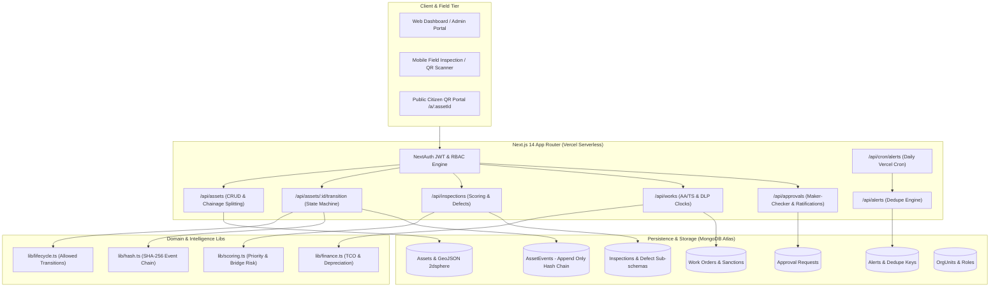
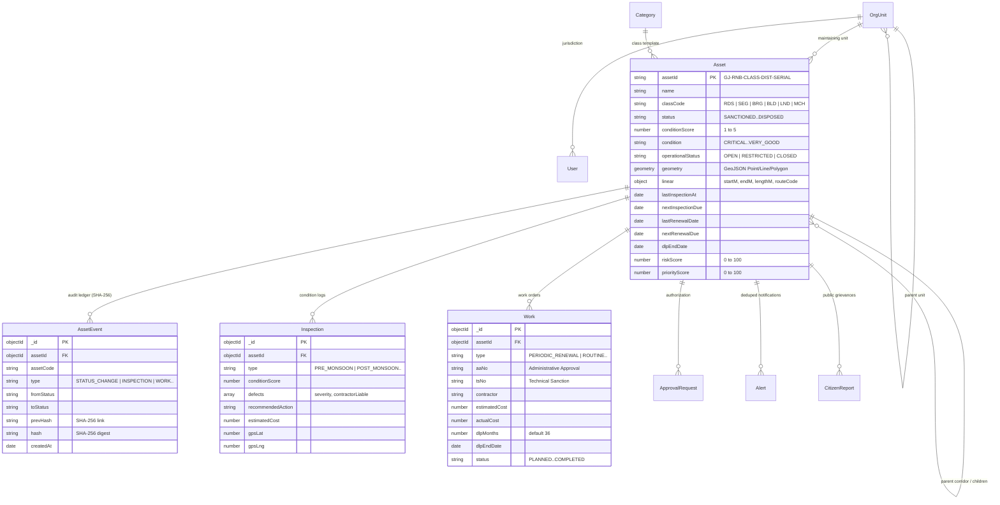
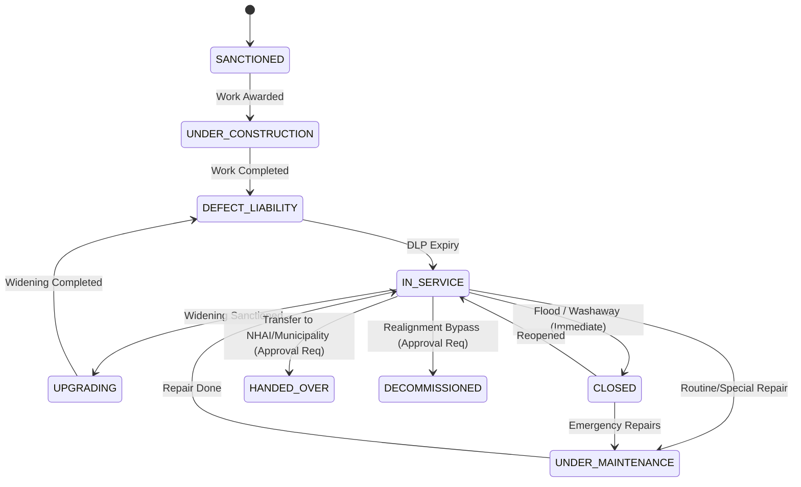
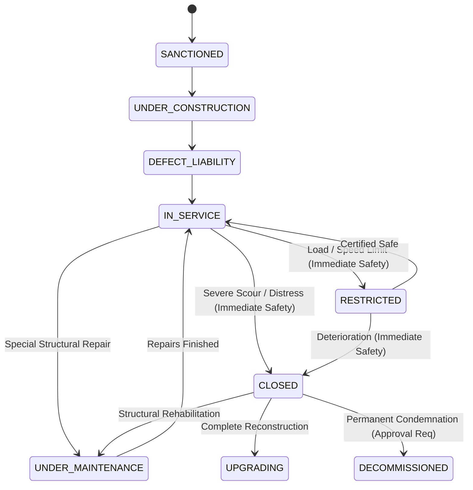
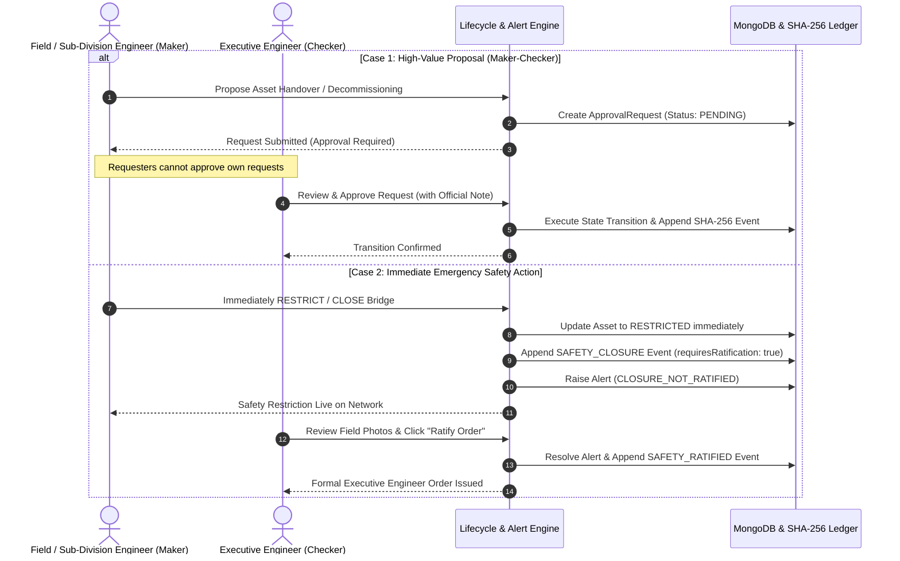

# RNB AssetTrail · Architecture & Domain Design Document
**Roads & Buildings (R&B) Department, Government of Gujarat**

---

## 1. Domain Understanding & Operational Context

The **Roads and Buildings (R&B) Department, Government of Gujarat** oversees critical public assets spanning tens of thousands of kilometers of state roadways, thousands of river bridges and cross-drainage structures, and a vast portfolio of institutional and administrative buildings.

### Key Domain Principles:
1. **Hierarchical Governance Structure:**
   $$\text{State HQ (Chief Engineer)} \rightarrow \text{Circle (Superintending Engineer)} \rightarrow \text{Division (Executive Engineer)} \rightarrow \text{Sub-division (DEE)} \rightarrow \text{Section (JE/AE)}$$
2. **Linear Homogeneous Road Modeling:**
   A long corridor (e.g. SH-4) cannot be treated as a single monolith because pavement type, width, traffic load, and deterioration vary by stretch. Modeling as **Parent Road $\rightarrow$ Child Segments by Chainage ($0+000$ to $12+500$)** allows granular condition monitoring and independent resurfacing cycles.
3. **Defect Liability Period (DLP) Warranty Enforcement:**
   Following new construction or periodic bituminous renewals, a mandatory **36-month DLP warranty** is activated. During this period, all inspection defects are legally flagged **"Contractor Liable"** for free contractor rectification.
4. **Monsoon Surveillance Cycles:**
   Gujarat roads and scour-vulnerable bridge structures undergo statutory **Pre-monsoon (April 1 – May 31)** and **Post-monsoon (October 1 – November 30)** inspection drives to prevent flood damage and bridge failures.

---

## 2. System Architecture Diagram

---

## 3. Entity-Relationship (ER) Diagram

---

## 4. Lifecycle State Machine Diagrams

### A. Roads & Homogeneous Segments

### B. Bridges & Cross-Drainage Structures

---

## 5. Maker-Checker & Emergency Safety Ratification Workflow

---

## 6. Assumptions to Confirm with Department Norms
1. **Approval Delegation Limits:** Configured as defaults ($\le ₹50\text{ Lakh}$ for EE, $\le ₹2.5\text{ Crore}$ for SE, $> ₹2.5\text{ Crore}$ for Chief Engineer).
2. **Defect Liability Duration:** Default set to 36 months for bituminous renewals and new structures.
3. **Monsoon Inspection Windows:** Pre-monsoon defined as April 1 – May 31; Post-monsoon defined as October 1 – November 30.
4. **Condition Scoring Scale:** Standard 1-5 scale implemented, mapped to bands (`CRITICAL`, `POOR`, `FAIR`, `GOOD`, `VERY_GOOD`), prepared for direct IRC/IBMS conversion.
